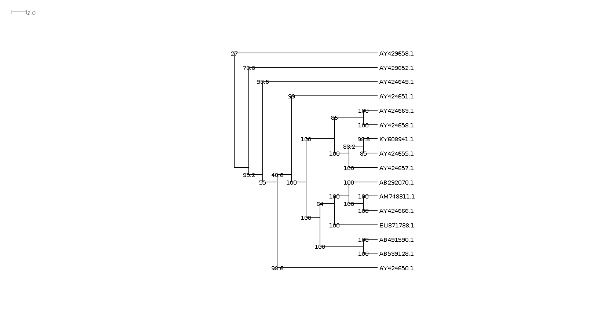
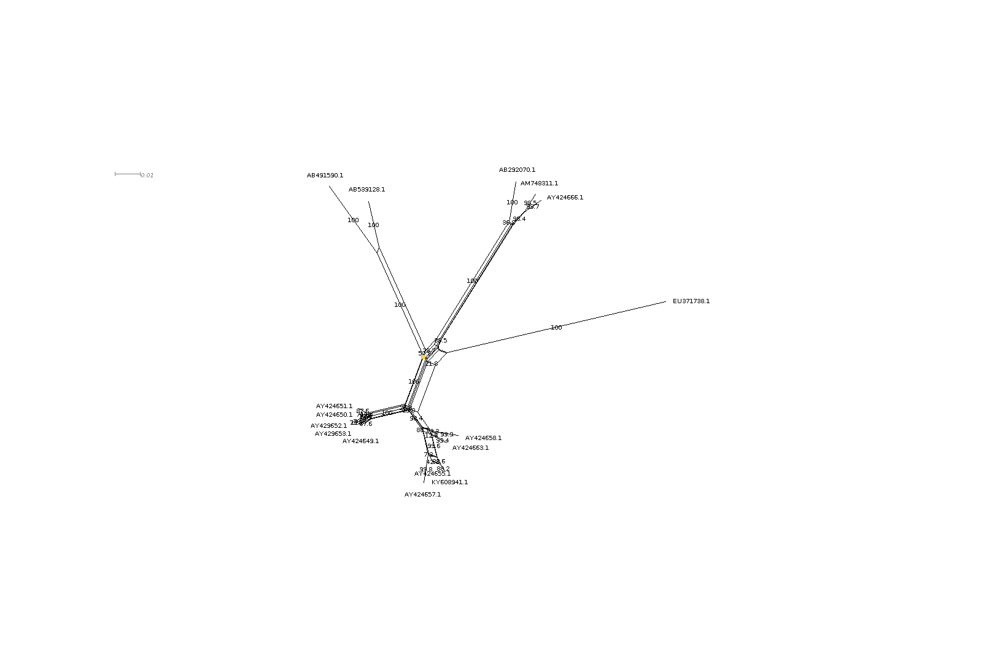

Student number 134323  

`r Sys.time()`

```{r setup, include=FALSE}
knitr::opts_chunk$set(echo = TRUE, warning = FALSE, message = FALSE)
library(dplyr)
library(ggplot2)
library(knitr)
library(readr)
library(seqinr)
library(bio3d)
set.seed(42)

```


# Background

A query sequence was aligned with targets in the NCBI nucleotide database using BLAST. Neighbour joining, maximum parsimony, maximum likelihood and phylogenetic network methods were used to estimate phylogenetic relationships between 16 of the returned sequences.

# Methods and Results {.tabset}

This section is tabbed to aid navigation.  

## BLAST

```{r, echo = FALSE}
sq <- as.vector(read.table("seq.txt")$V1)
```

The BLASTn algorithm [@altschul1997gapped] was used to find high-scoring segment pairs (HSP) for the nucleotide query sequence `r sq` against the database maintained at [NCBI](https://blast.ncbi.nlm.nih.gov/). An API call was made initially using the R package `annotate` [@gentleman2018], however a query using the website interface proved to be much faster. Results were saved by copying and pasting the resulting table into Excel and saving as a .csv file.  

```{r, eval = FALSE}
#biocLite("annotate")
library(annotate)
bs <- blastSequences(sq, timeout = 480, as = "data.frame")
```

### BLAST Results

A search of the NCBI nucleotide databases suggests that the query sequence is most likely from the genome of a fur seal (sp *Arctocephalus*), encoding for sex determining region Y protein.  

```{r}
bs <- read_csv("bs.csv")

dplyr::select(bs, Accession, Description, `E value`, `Per. Ident`, `Query Cover`) %>%
  dplyr::arrange(`E value`) %>%
  kable()

```

```{r}
ggplot(bs, aes(x = `E value`, fill = factor(substr(Description, 1, 5)))) + 
  geom_histogram()

```

### Query cover

Query cover is the proportion of characters of the query sequence that are included in the [aligned] target sequence (x100).


### Percent identity

Percent identity describes the proportion of characters in the query sequence that match the target sequence (x100), such that identical sequences will have a percent identity of 100% and sequences with no matching characters will have a percent identity of 0%.  

This number is not adjusted for the length of the query or target sequences, nor does it take into account the probability of matching by chance.  


### *E*-value

#### Pairwise *E*-value

Consider the comparison of two sequences. Interest lies in determining whether there is evidence of shared ancestry (homology) between the sequences. A local alignment comprises an equal length segment from each sequence. Sufficient similarity between the aligned segments may be evidence of homology. However similarity can occur by chance so it is helpful to estimate the likelihood of observing the alignment by chance alone, using a model of random sequences [@altschul1990basic].  

For sufficiently large random sequences of lengths $m$ and $n$, the expected number (*E*-value) of local alignments with score at least $S$ is given by  

\[E \approx K mn e^{-\lambda S}\]

where $K$ and $\lambda$ are natural scales for the search space size and the scoring system respectively [@altschul1990basic]. Thus, *E*-value gives a better measure of the **significance** of a match between query and target sequence than percent identity, as it makes a correction for the search space.  

```{r, echo = FALSE}
S <- seq(0, 10, by = 0.5)
E <- 2^-S
plot(E ~ S, xlab = "S'", type = "l", yaxt = "n", xaxt= "n")
```

The probability of finding exactly $z$ HSPs with score $\geq S$ is Poisson distributed  
\[e^{-E} {E^z \over z!}\]  

because the probability of finding $z = 0$ HSPs with score $\geq S$ is $e^{-E}$, the probability of finding at least one HSP with score $\geq S$ is  
\[P = 1- e^{-E}\]

For small $E$, *P*-values and *E*-values are approximately equivalent. *E*-values are reported in BLAST results because they are intuitively easier to grasp.  

#### Database *E*-values

NCBI BLAST treats the database of sequences as a single very long sequence of length $N$, and calculate *E*-values using this in the place of $n$ in the above equation. **Thus, the *E*-values reported in the table above describe how many times you would expect a match by chance in a database containing all of the nucleotide sequences stored in the NCBI database.**  

## Alignment

16 sequences were chosen from different species and downloaded. They were then aligned using clustal omega [@sievers2014clustal] and also with muscle [@edgar2004muscle] in Seaview [@gouy2009seaview]. Both alignments looked plausible, starting identically up to about 80 base-pairs.  

```{r}
aligned <- bio3d::read.fasta("fasta_15.fst")
print.fasta(aligned)

```

## Neighbour Joining

SplitsTree4 [@huson2005application] was used to build neighbour-joining trees, using 1000 bootstrap replicates to estimate robustness of the tree.  



## Maximum Parsimony Tree

PHYLIP v3.696 [@felsenstein2004phylip] was used to compute parsimony trees in SeaView [@gouy2009seaview].  


## Maximum Likelihood Tree

ModelFinder [@kalyaanamoorthy2017modelfinder] was used to select the best fitting tree from maximum likelihood models fitted in IQ-Tree (v.1.6.10-Windows) [@nguyen2014iq]. Model robustness was estimated using a bootstrap procedure (UFBoot [@hoang2017ufboot2]).  

```{r, eval = FALSE}
# I didn't have room for Linux VM on home computer where I was doing this
cmd <- "iqtree-1.6.10-Windows\\bin\\iqtree -s fasta_15.nxs -bb 1000 -nt 2"
system(cmd)

```

```{r}
cat(read_file("fasta_15.nxs.log"))
```
```{r}
cat(read_file("fasta_15.nxs.iqtree"))

```

IQ-Tree fits models using maximum likelihood (ML) then selects the 'best' model using Bayesian Information Criteria (BIC). Likelihood estimates the probability of the sequences given a model of their evolution on a tree, $P(Y|\theta)$, where$Y$ are the observed sequences and $\theta$ are phylogenetic trees. Unfortunately, ML can't tell us $P(\theta|Y)$, but we can at least estimate which model out of all the ML models fitted explains the observed data the best. Information criteria can be thought of as a distance to a (usually unknowable) 'true' model of the data/sequence-generating process, such that the model with the smallest BIC is the model that 'best' explains the observed data (according to BIC) and is, under the model assumptions (including the sampling model), closest to the 'true' model.  

ML models are computationally expensive, so traditional bootstrap replication can take an unreasonable long time to compute. UFBoot speeds up this process by applying stopping rules and judicious selection of candidate trees. A drawback is that support for a clade requires a more stringent cut-off (95% or higher, rather than the traditional 80% often advocated for non-parametric bootstrap resampling).  

The tree presented above has several clades with weak support, suggesting large gaps in the evolutionary model.  

## Phylogenetic Network

HKY distances were used to estimate a phylogenetic network in SplitsTree4 [@huson2005application].  


  
  
  
  
# Discussion

There was broad agreement between the trees estimated using neighbour joining, maximum parsimony, and maximum likelihood methods. Bootstrap estimates provided support for the most closely related species, but provided much less support where more evolutionary distant species were placed in clades. For example, there was good support for {`AB539128.1`, `AB491590.1`} (100% of bootstrap replications) and {`AY424666.1`, `AM748311.1`, `AB292070.1`} (98-100% of boostrap replications), but much less support for placing these clades together on a branch (61-64% of bootstrap replications).  

It was difficult to compare the phylogenetic network with the trees.

# Data and source code

Data including model summary output and code used to produce this document can be accessed at [github.com/ABindoff/kma712_ass1](https://github.com/ABindoff/kma712_ass1)

# References


